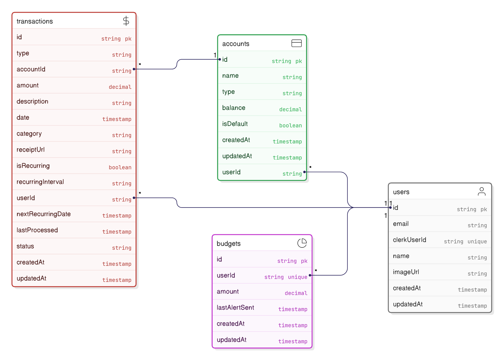

# Full Stack Платформа финансового менеджмента с ИИ
<div align="center">


</div>

project_tt4u - это интеллектуальная платформа финансовой аналитики на базе искусственного интеллекта. Она помогает пользователям отслеживать расходы, анализировать финансовые тенденции и принимать решения на основе данных без особых усилий.  

## Функции и особенности

1. **Современный UI/UX** – Отзывчивый и интуитивно понятный дизайн.
2. **Безопасная авторизация с Clerk** - Авторизация с помощью Google или Github. Возможность выбрать аватар.
3. **Руководство финансами** - Возможность выбора бюджета на месяц, иллюстрирующие графики от Shadcn UI с категоризацией. Два типа счетов и мультисчётные аккаунты.
4. **Система транзакций с ИИ-сканером чеков** - Добавление транзакций вручную и со сканером чека Google Gemini. Возможность сортировки, удаления и регулярного платежа.
5. **Финансовая аналитика от ИИ** – Получение индивидуальных рекомендаций от ИИ на почту с помощью Resend Inngest   
6. **Данные в режиме реального времени** – Получение финансовых обновлений в режиме реального времени для принятия более эффективных решений. Защита от атак и перегрузок с Arcjet.

## Тех. Stack  

- **Frontend:** Next.js 15, React 19, TypeScript, Tailwind CSS
- **Backend:** Node.js, Express
- **Database:** PostgreSQL (via Supabase)
- **AI Integration:** Google Gemini
- **Deployment:** Vercel

## Представление DB



## Начало работы

1. Клонируйте репозиторий

2. Установите зависимости:
npm install

*При ошибках:* npm install --legacy-peer-deps и npm audit fix --force

Отдельно проверим установку ключевых ресурсов:

3. Создание таблиц с миграциями Prisma
npx prisma migrate dev --name init  # Создает миграции на основе schema.prisma
npx prisma db push                  # Применяет изменения к базе Supabase

4. Установка Inngest и деплой его функций
npm install -g inngest --legacy-peer-deps

npx inngest deploy `
  --api-key YOUR_API_KEY `
  --file "path/to/file"
  
5. Сетап .env файла
```
NEXT_PUBLIC_CLERK_PUBLISHABLE_KEY=
CLERK_SECRET_KEY=

NEXT_PUBLIC_CLERK_SIGN_IN_URL=/sign-in
NEXT_PUBLIC_CLERK_SIGN_UP_URL=/sign-up

# Connect to Supabase via connection pooling with Supavisor.
DATABASE_URL=

# Direct connection to the database. Used for migrations.
DIRECT_URL=
        
ARCJET_KEY=

GEMINI_API_KEY=
```

6. Локальный запуск:
 npm run dev


**© 2025 nester.era@gmail.com**
